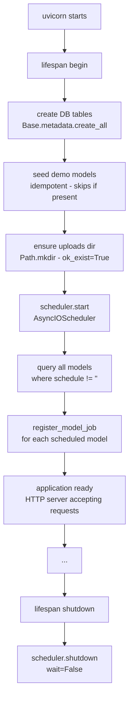
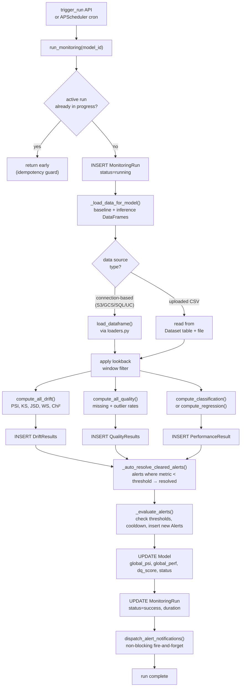

# MLMonitor — Architecture Deep Dive

## Module Map

```
backend/
├── app/
│   ├── main.py                  # FastAPI app, lifespan events, CORS, router mount
│   ├── config.py                # Settings (Pydantic BaseSettings, env-var driven)
│   │
│   ├── api/
│   │   ├── v1.py                # Router aggregator — mounts all route groups at /api/v1
│   │   ├── deps.py              # FastAPI dependencies (get_db session factory)
│   │   └── routes/
│   │       ├── models.py        # Model CRUD + detail (PSI timeline, alerts, runs)
│   │       ├── runs.py          # Monitoring run trigger + status
│   │       ├── drift.py         # Drift timeline + feature histogram queries
│   │       ├── alerts.py        # Alert list + assignment/status update
│   │       ├── datasets.py      # CSV/Parquet upload + dataset list
│   │       ├── connections.py   # Storage connection CRUD + test + browse
│   │       ├── notifications.py # Notification channel CRUD + test
│   │       ├── api_keys.py      # API key create/list/revoke
│   │       ├── teams.py         # Team CRUD + membership management + IdP sync
│   │       └── users.py         # User CRUD (soft delete via is_active)
│   │
│   ├── db/
│   │   ├── base.py              # DeclarativeBase for SQLAlchemy ORM
│   │   ├── session.py           # Async engine + AsyncSessionLocal + get_db()
│   │   ├── models.py            # All 13 ORM entity classes
│   │   └── seed.py              # Demo data seeder (12 models, 15 runs each)
│   │
│   ├── engine/
│   │   ├── runner.py            # Main orchestrator: run_monitoring(model_id)
│   │   ├── drift.py             # PSI, KS, JSD, Wasserstein, Chi² computation
│   │   ├── performance.py       # Classification + regression metrics (sklearn)
│   │   ├── quality.py           # Missing rate + IQR outlier detection
│   │   ├── loaders.py           # Multi-source DataFrame loader (S3/GCS/SQL/upload)
│   │   └── connectors.py        # Connection browser + tester (S3/GCS/SQL/Unity Catalog)
│   │
│   ├── scheduler/
│   │   └── __init__.py          # APScheduler singleton + job registration helpers
│   │
│   ├── alerts/
│   │   └── dispatcher.py        # Alert + assignment notification dispatch
│   │
│   └── schemas/
│       ├── model.py             # ModelCreate, ModelUpdate, ModelRead, ModelSummary
│       ├── run.py               # RunRead
│       ├── alert.py             # AlertRead, AlertUpdate, AssignedUserRead
│       ├── dataset.py           # DatasetRead
│       ├── connection.py        # StorageConnectionCreate/Update/Read
│       ├── api_key.py           # ApiKeyCreate/Read/Created
│       ├── notification.py      # NotificationChannelCreate/Update/Read, TestResult
│       ├── team.py              # TeamCreate/Update/Read/WithMembers, SyncRequest
│       └── user.py              # UserCreate/Update/Read/WithTeams
│
├── alembic/
│   ├── env.py                   # Alembic runner (imports Base metadata)
│   └── versions/                # Migration files (sequential revision chain)
│
└── pyproject.toml               # Project metadata + dependencies + pytest config
```

---

## Application Bootstrap

When the FastAPI application starts, a lifespan context manager runs the following initialisation sequence:



**Key properties:**
- `create_all` is safe to re-run; it only creates tables that don't already exist (Alembic handles schema changes)
- Demo seeding is guarded by a name-based existence check — safe to restart
- Job registration uses `replace_existing=True` — safe to re-register on restarts

---

## Monitoring Engine Flow

The core business logic lives in `app/engine/runner.py`. A monitoring run is triggered either by the APScheduler cron job or via the API endpoint and executes this pipeline:



### Idempotency

Runs are identified by `model_id` + time window. The in-progress guard (`status = 'running'` check) prevents duplicate concurrent executions. Re-triggering a model after a run completes produces a new run record with a new time window.

---

## Data Loading Strategy

`_load_data_for_model()` resolves the data source for each run:

```
Model.reference_dataset_config  →  baseline DataFrame
Model.inference_dataset_config  →  inference DataFrame
```

**Decision tree:**

1. If both `reference_dataset_config` and `inference_dataset_config` are set and `source_type != "upload"`:
   - Look up the `StorageConnection` by `connection_id`
   - Dispatch to `load_dataframe(source_config, connection_config, time_filter)` in `loaders.py`
   - `load_dataframe` dispatches by `source_type`:
     - `s3` → boto3, reads CSV or Parquet from S3
     - `gcs` → google-cloud-storage, reads CSV or Parquet from GCS
     - `sql` → SQLAlchemy `read_sql`, optionally adds `WHERE timestamp_col BETWEEN start AND end`
     - `unity_catalog` → raises `NotImplementedError` (use `sql` source with Databricks JDBC instead)
   - All sync I/O runs in `asyncio.run_in_executor(None, ...)` to avoid blocking the event loop

2. Fallback (uploaded CSVs):
   - Query `Dataset` table for the most recent `role=baseline` and `role=production` datasets for this model
   - Read from `file_path` on disk

3. Apply **lookback window**:
   - Parse `model.lookback_window` (e.g., `"7d"`, `"30d"`) into a `timedelta`
   - Filter inference DataFrame to `[now - window, now]` using the `timestamp_col` if available

---

## Alert Lifecycle and Cooldown

### State Machine

```
open  ──assign/ack──▶  acknowledged  ──auto-resolve──▶  resolved
  │                                                          ▲
  └─────────────────auto-resolve──────────────────────────────┘
  ▲
  └── manual reopen (PATCH status=open)
```

### Threshold Configuration

Default thresholds (configurable per model via `psi_warn_threshold` / `psi_crit_threshold`):

| Metric | WARNING | CRITICAL |
|--------|---------|---------|
| PSI | ≥ 0.10 | ≥ 0.25 |
| missing_rate | ≥ 15% | ≥ 30% |
| outlier_rate | ≥ 10% | ≥ 20% |
| accuracy / f1 / auc_roc / precision / recall | < 0.80 / 0.78 / 0.80 / 0.75 / 0.75 | < 0.70 / 0.65 / 0.70 / 0.60 / 0.60 |
| r² | < 0.70 | < 0.50 |
| MAE | ≥ 0.20 | ≥ 0.40 |
| RMSE | ≥ 0.25 | ≥ 0.50 |

### Cooldown Mechanism

When an alert fires for `(model_id, metric_name, feature_name, severity)`:
1. `cooldown_until = now + timedelta(hours=model.alert_cooldown_hours)` (default: 6h)
2. On the next run, `_evaluate_alerts()` first checks for an existing open alert with `cooldown_until > now`
3. If found → skip; if not found → create a new alert

This prevents duplicate pages for persistent conditions. The cooldown resets whenever the condition resolves and re-triggers.

---

## Scheduler Architecture

MLMonitor uses **APScheduler 3.10** (`AsyncIOScheduler`) as an in-process scheduler. There is no external job queue (no Celery, no Redis required for scheduling).

```python
# scheduler/__init__.py
scheduler = AsyncIOScheduler(timezone="UTC")

def register_model_job(model_id: str, cron: str) -> None:
    trigger = CronTrigger.from_crontab(cron, timezone="UTC")
    scheduler.add_job(
        run_monitoring,
        trigger=trigger,
        id=f"model_{model_id}",
        args=[model_id],
        replace_existing=True,         # idempotent re-registration
        misfire_grace_time=3600,       # fire up to 1h late if worker was down
        coalesce=True,                 # merge multiple missed fires into one
    )
```

**Lifecycle events:**
- `scheduler.start()` is called in `app/main.py` lifespan on startup
- All models with a non-empty `schedule` field are registered at startup
- Creating/updating a model with a schedule calls `register_model_job()` or `reschedule_model_job()`
- Deleting a model calls `remove_model_job()`

**Limitations:**
- Jobs are stored in-memory only — they are re-registered from the database on every restart
- Not suitable for distributed multi-process deployments without an APScheduler persistent store (e.g., SQLAlchemy jobstore)

---

## Multi-Tenancy and RBAC

### Data Isolation

Models belong to a `team` (string field). The teams table stores team metadata and supports external IdP integration. Access control is currently enforced at the application layer (not via database row-level security).

### Role Hierarchy

```
can_admin
  └── can_manage  (+ team member management)
        └── can_edit  (+ model CRUD, run triggers)
              └── can_review  (read-only)
```

### External IdP Sync

The `POST /api/v1/teams/{team_id}/sync` endpoint accepts a bulk list of members (from Okta, Azure AD, Google Workspace, LDAP) and performs an upsert:

```
For each member in payload:
  1. Match by external_id (primary) or email (fallback)
  2. Create User if not found
  3. Upsert TeamMembership with provided role
  4. Remove any existing TeamMembership where source=external and user NOT in payload
```

This allows automated provisioning pipelines to keep team membership in sync with corporate directories.

---

## Notification Dispatch

`app/alerts/dispatcher.py` handles two types of notifications:

**1. Alert notifications** (`dispatch_alert_notifications`):
Called after every successful monitoring run with newly fired alerts. Fetches all enabled channels and calls `_send()` for each `(alert, channel)` pair.

**2. Assignment notifications** (`dispatch_assignment_notification`):
Called when an alert is assigned to a user via `PATCH /alerts/{id}`. Sends to all enabled channels, including the assignee's email address.

All exceptions in dispatch are silently caught — notification failures never propagate to callers.

### Channel Implementations

| Channel | Method | Key Fields Used |
|---------|--------|----------------|
| Slack | `httpx.AsyncClient.post(webhook_url)` | Formatted text with severity emoji, metric, model, team, link |
| PagerDuty | `httpx.AsyncClient.post(events_api_v2)` | `routing_key`, `dedup_key` = `mlmonitor-{model_id}-{metric}-{severity}` |
| Email | `smtplib.SMTP` in executor | STARTTLS, optional auth; multi-recipient |
| Webhook | `httpx.AsyncClient.post(url)` | JSON payload; optional HMAC-style secret header |

---

## Key Design Decisions

### 1. Async-First, Sync I/O in Executors
All API handlers are `async def`. Sync I/O (pandas, boto3, SQLAlchemy synchronous engines, smtplib) runs in `asyncio.run_in_executor(None, fn)` to avoid blocking the event loop.

### 2. No External Queue
APScheduler runs inside the FastAPI process. Monitoring runs are dispatched via `asyncio.create_task(run_monitoring(model_id))` from the API trigger endpoint. This simplifies deployment (no Redis, no Celery workers) at the cost of single-node scheduling.

### 3. Idempotent Runs
Re-executing the same `(model_id, window_start, window_end)` produces the same results. The in-progress guard prevents concurrent duplicate runs.

### 4. Non-Blocking Notifications
`dispatch_alert_notifications()` is called with `asyncio.create_task()` or awaited after the run commits. Failures are silently swallowed. Run status is never affected by notification failures.

### 5. Additive Migrations Only
Alembic migrations never drop or rename columns. New columns are always nullable or have defaults. This keeps backward-compatible rollbacks safe.

---

## Extension Points

### Adding a New Drift Metric

1. Add the computation function to `app/engine/drift.py`
2. Add the result field to `DriftResult` ORM model (`app/db/models.py`)
3. Create an Alembic migration to add the column
4. Add the field to the `_evaluate_alerts()` threshold check in `runner.py` if it should generate alerts

### Adding a New Data Source

1. Add the `source_type` value to the `DataSourceConfig` schema
2. Implement `_load_{source}_sync()` in `app/engine/loaders.py`
3. Dispatch it in `load_dataframe()`
4. Add a `browse_{source}()` implementation in `app/engine/connectors.py`
5. Document the config JSON shape in [er-model.md](er-model.md)

### Adding a New Notification Channel

1. Add the `type` value to the channel schema
2. Add the `elif ch.type == "new_channel":` branch in `app/alerts/dispatcher.py` (both `_send()` and `dispatch_assignment_notification()`)
3. Document the config JSON shape in [er-model.md](er-model.md)
