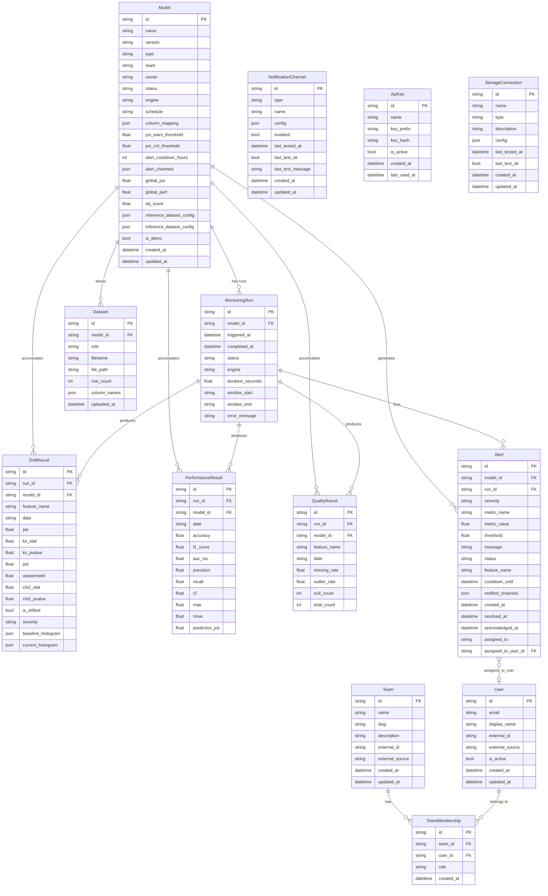
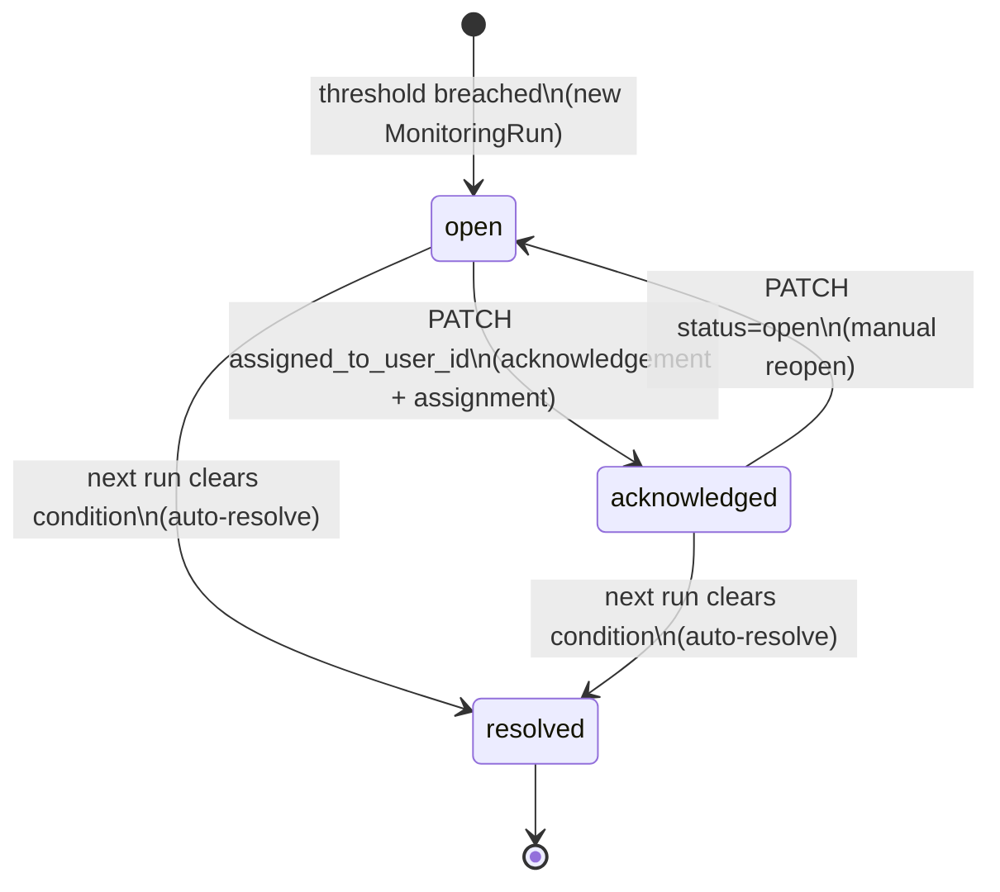

# MLMonitor — Entity Relationship Model

## ER Diagram

---

## Entity Descriptions

| Entity | Primary Key | Purpose | Key Fields |
|--------|-------------|---------|-----------|
| **Model** | `id` (UUID) | Registered ML model with monitoring configuration | `name`, `type`, `team`, `status`, `schedule`, `column_mapping`, `psi_warn_threshold`, `psi_crit_threshold`, `alert_cooldown_hours`, `global_psi`, `global_perf`, `dq_score`, `is_demo` |
| **MonitoringRun** | `id` (UUID) | Single execution of the monitoring pipeline | `model_id`, `triggered_at`, `completed_at`, `status`, `window_start`, `window_end`, `duration_seconds`, `error_message` |
| **DriftResult** | `id` (UUID) | Feature-level drift metrics for one run | `run_id`, `feature_name`, `psi`, `ks_stat`, `jsd`, `wasserstein`, `chi2_stat`, `is_drifted`, `severity`, `baseline_histogram`, `current_histogram` |
| **PerformanceResult** | `id` (UUID) | Model performance metrics for one run | `run_id`, `accuracy`, `f1_score`, `auc_roc`, `precision`, `recall` (classification); `r2`, `mae`, `rmse` (regression); `prediction_psi` |
| **QualityResult** | `id` (UUID) | Per-feature data quality for one run | `run_id`, `feature_name`, `missing_rate`, `outlier_rate`, `null_count`, `total_count` |
| **Alert** | `id` (UUID) | Threshold violation with lifecycle tracking | `model_id`, `run_id`, `severity`, `metric_name`, `metric_value`, `threshold`, `status`, `cooldown_until`, `created_at`, `acknowledged_at`, `resolved_at`, `assigned_to_user_id` |
| **Dataset** | `id` (UUID) | Uploaded baseline or production dataset | `model_id`, `role` (baseline/production), `filename`, `file_path`, `row_count`, `column_names` |
| **NotificationChannel** | `id` (UUID) | Alert notification destination | `type` (slack/pagerduty/email/webhook), `name`, `config`, `enabled`, `last_test_ok` |
| **ApiKey** | `id` (UUID) | Programmatic API access credential | `name`, `key_prefix` (first 12 chars), `key_hash` (SHA-256), `is_active` |
| **StorageConnection** | `id` (UUID) | External data source connection | `name`, `type` (s3/gcs/sql/unity_catalog/kafka), `config`, `last_test_ok` |
| **Team** | `id` (UUID) | Organisational grouping of models and users | `name`, `slug` (unique), `external_id`, `external_source` (okta/azure_ad/google/ldap) |
| **User** | `id` (UUID) | Platform user (no auth credentials stored) | `email`, `display_name`, `is_active`, `external_id`, `external_source` |
| **TeamMembership** | `id` (UUID) | Join table: Team ↔ User with role | `team_id`, `user_id`, `role` (can_review/can_edit/can_manage/can_admin) |

---

## JSON Column Inventory

Several columns store structured data as JSON blobs to allow schema flexibility without additional tables:

| Table | Column | Shape | Description |
|-------|--------|-------|-------------|
| `models` | `column_mapping` | `{features: [], prediction_col, score_col, target_col, timestamp_col, segment_cols: []}` | Maps dataset columns to monitoring roles |
| `models` | `reference_dataset_config` | `{source_type, connection_id?, path?, format?}` | Where to load the baseline dataset |
| `models` | `inference_dataset_config` | `{source_type, connection_id?, path?, format?}` | Where to load the production/inference dataset |
| `models` | `alert_channels` | `["channel-name-1", "channel-name-2"]` | List of notification channel names that receive alerts for this model |
| `alerts` | `notified_channels` | `["slack", "email"]` | Channels that were successfully notified for this alert |
| `drift_results` | `baseline_histogram` | `{bins: [], counts: []}` | Histogram of the baseline distribution for a feature |
| `drift_results` | `current_histogram` | `{bins: [], counts: []}` | Histogram of the production distribution for a feature |
| `notification_channels` | `config` | Varies by type (see below) | Channel-specific credentials and settings |
| `storage_connections` | `config` | Varies by type (see below) | Connection credentials and parameters |
| `datasets` | `column_names` | `["col_a", "col_b", ...]` | List of column names inferred at upload time |

### `notification_channels.config` by type

| Type | Required Fields | Optional Fields |
|------|----------------|-----------------|
| `slack` | `webhook_url` | — |
| `pagerduty` | `integration_key` | — |
| `email` | `smtp_host`, `recipients` (comma-separated) | `smtp_port` (default 587), `smtp_user`, `smtp_pass`, `from_addr` |
| `webhook` | `url` | `secret_header_name`, `secret_header_value` |

### `storage_connections.config` by type

| Type | Required Fields | Optional Fields |
|------|----------------|-----------------|
| `s3` | `bucket`, `aws_access_key_id`, `aws_secret_access_key` | `region_name` (default us-east-1) |
| `gcs` | `bucket` | `service_account_json` (path or JSON string) |
| `sql` | `connection_string` | — |
| `unity_catalog` | `workspace_url`, `token` | `catalog`, `schema` |

---

## Role Hierarchy (TeamMembership.role)

| Role | Permissions |
|------|------------|
| `can_review` | Read-only: view models, runs, alerts, drift data |
| `can_edit` | Full CRUD on team's models, upload datasets, trigger runs |
| `can_manage` | Edit + manage team members (add/remove/update roles) |
| `can_admin` | All of the above + cross-team access + system configuration |

---

## Alert Lifecycle

**Cooldown:** After an alert fires, the same `(model_id, metric_name, feature_name, severity)` tuple enters a cooldown period (default: 6 hours, configurable per model). No new alert is created until the cooldown expires.

---

## Migration History

| Revision | Name | Changes |
|----------|------|---------|
| `7e8fcec48d54` | `add_dataset_configs_to_model` | Adds `reference_dataset_config` and `inference_dataset_config` JSON columns to `models` |
| `a1b2c3d4e5f6` | `add_is_demo_to_model` | Adds `is_demo` boolean to `models` (default: false) |
| `b3c4d5e6f7a8` | `add_teams_users_memberships` | Creates `teams`, `users`, `team_memberships` tables; seeds 6 legacy teams |
| `c4d5e6f7a8b9` | `add_alert_assignment_tracking` | Adds `assigned_to_user_id` (FK) and `acknowledged_at` (datetime) to `alerts` |

Run `alembic upgrade head` to apply all migrations. Run `alembic current` to check the current database revision.
