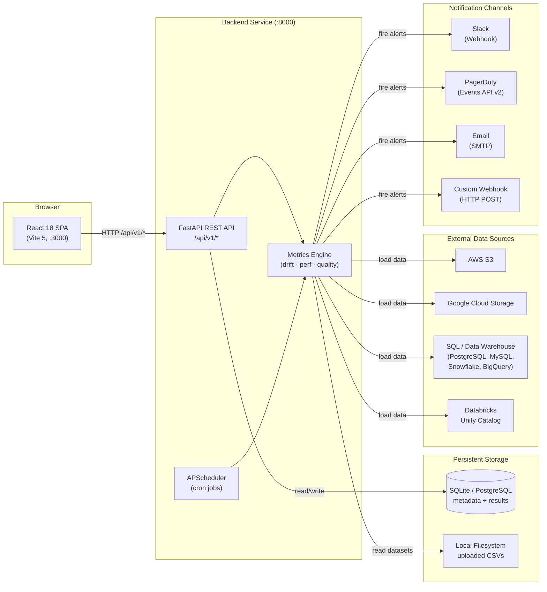

# MLMonitor — System Overview

## What is MLMonitor?

MLMonitor is a production-grade ML model monitoring platform that provides continuous observability over deployed machine learning models. It detects data drift, concept drift, and performance degradation proactively — before they silently degrade model predictions in production. Inspired by platforms like Arize AI, NannyML, Evidently AI, and WhyLabs, MLMonitor is self-hosted, extensible, and designed for engineering teams that own their own ML infrastructure.

---

## Architecture at a Glance

The system consists of four logical tiers: a browser-based dashboard, a FastAPI backend service, a relational database for metadata and results, and external integrations for data sources and notification channels. An in-process scheduler drives automatic monitoring runs on user-defined cron schedules.

---

## Component Descriptions

| Component | Technology | Responsibility |
|-----------|-----------|----------------|
| **React SPA** | Vite 5, React 18, Recharts | Dashboard UI: model list, drift charts, alert management, settings |
| **FastAPI Backend** | Python 3.11, FastAPI 0.111, Uvicorn | REST API, request validation, business logic orchestration |
| **Metrics Engine** | NumPy 1.26, SciPy 1.13, pandas 2.2, scikit-learn 1.5 | Computes PSI, KS, JSD, Wasserstein, Chi², classification/regression metrics, data quality |
| **APScheduler** | APScheduler 3.10 (in-process) | Triggers monitoring runs on cron schedules; no external queue required |
| **SQLite / PostgreSQL** | SQLAlchemy 2.0 async, Alembic | Stores model configs, run records, metric results, alerts, teams, users |
| **File Storage** | Local filesystem | Stores uploaded baseline and production CSV/Parquet datasets |
| **S3 / GCS / SQL / Unity Catalog** | boto3, google-cloud-storage, SQLAlchemy | External data sources for loading baseline and inference data at scale |
| **Slack** | Incoming Webhooks | Real-time alert notifications in Slack channels |
| **PagerDuty** | Events API v2 | On-call alerting with deduplication and incident management |
| **Email (SMTP)** | Python smtplib + STARTTLS | Alert notifications via email; supports assignee auto-inclusion |
| **Custom Webhook** | httpx HTTP POST | Generic alert notifications for any downstream system |

---

## End-to-End Flow: From Model Onboarding to Alert

The following narrative walks through the primary user journey:

**1. Register a Model**
An engineer calls `POST /api/v1/models` (or uses the 7-step onboarding wizard in the UI) to register an ML model. They provide the model type (classification/regression), column mapping (features, prediction column, target column), data source configuration (S3 path, SQL query, or uploaded CSV), drift thresholds, and a monitoring cron schedule.

**2. Upload or Connect Data**
The team either uploads a baseline CSV via `POST /api/v1/models/{id}/datasets` or configures a storage connection (`POST /api/v1/connections`) pointing to an S3 bucket, GCS path, or SQL table. Production (inference) data follows the same pattern.

**3. Trigger a Monitoring Run**
Runs are triggered in two ways:
- **Automatically** — APScheduler fires the cron job, calling `run_monitoring(model_id)` in the background
- **Manually** — `POST /api/v1/models/{id}/runs` triggers an immediate async run (HTTP 202 Accepted)

**4. Metrics Computation**
The engine loads baseline and production DataFrames, applies the lookback window, and computes in parallel:
- **Drift** — PSI, KS, JSD, Wasserstein, Chi² per feature
- **Data Quality** — missing rates and outlier rates per feature
- **Performance** — accuracy, F1, AUC-ROC (classification) or MAE, RMSE, R² (regression)

**5. Alert Evaluation**
After computing metrics, the engine checks each result against configured thresholds (PSI > 0.25 = CRITICAL, missing_rate > 30% = CRITICAL, etc.). Alerts that have already fired within the cooldown window are suppressed. Newly cleared conditions auto-resolve existing open alerts.

**6. Notifications Dispatched**
New alerts are dispatched to all enabled notification channels (Slack, PagerDuty, Email, Webhook) concurrently. Notification failures never block the run.

**7. Dashboard Updates**
The React SPA polls the API every 30 seconds. Engineers see updated model status (healthy/warning/critical), PSI timelines, feature drift heatmaps, and the alert feed.

**8. Alert Assignment & Resolution**
An on-call engineer acknowledges an alert and assigns it to a team member via the UI. The assigned engineer receives a notification. Once the next monitoring run confirms the metric has returned below threshold, the alert auto-resolves.

---

## Tech Stack

| Layer | Technology | Version |
|-------|-----------|---------|
| Web Framework | FastAPI | 0.111+ |
| ASGI Server | Uvicorn | 0.29+ |
| ORM | SQLAlchemy (asyncio) | 2.0+ |
| Migrations | Alembic | 1.13+ |
| Validation | Pydantic | 2.7+ |
| Database (dev) | SQLite + aiosqlite | 3.x |
| Database (prod) | PostgreSQL | 15+ |
| Scheduler | APScheduler | 3.10+ |
| HTTP Client | httpx | 0.27+ |
| Data Processing | pandas, NumPy, SciPy | 2.2, 1.26, 1.13 |
| ML Metrics | scikit-learn | 1.5+ |
| Frontend | React 18 + Vite 5 | 18.3, 5.4 |
| Charts | Recharts | 2.12 |
| Notifications | Sonner | 2.0 |
| Containerisation | Docker + Docker Compose | 24+ |
